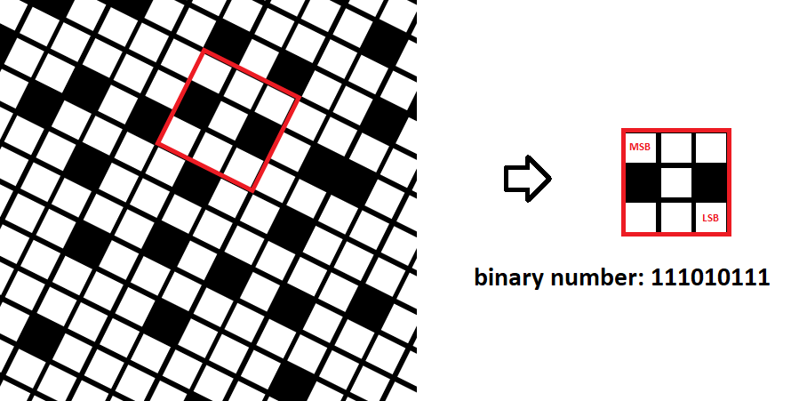
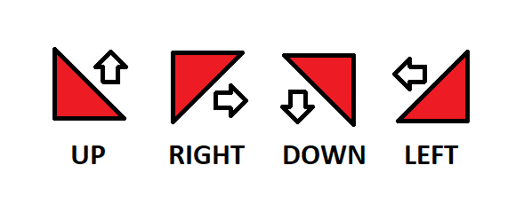

# Recognizing the position of an object, in a two-dimensional system, taking into account the orientation
## Author Bartosz Popielarczyk

The goal of the project is to determine in real time the position in which the vehicle is located based on a reading from a camera placed in the chassis of the mobile object. The transporter moves along an MxN binary image modified for orientation recognition. The position relative to the whole image is decoded based on reading a binary value depending on a kernel matrix (could be 3x3, 4x4 or 5x5).

  

The binary image along which the vehicle will move is not a set of random values. The direction has been encoded in the way of changing the shape of the "pixel", namely, a corner was cut off along with a change in its color for easier detection. Knowing that the resulting triangle has four possibilities of rotation, we are using its orientation to determine the direction of our vehicle.

  

## Todo-list
- [x] Calculation of the pixel square side size depending on the camera position
- [ ] Possibility to change the kernel
- [ ] Calculation of the binary value compatible with the rotation
- [ ] Decoding a binary mask into the position of a point in space
- [ ] Visualization the position relative to the whole binary image

### Equipment
Everything is implemented using a raspberry pi 4B and an OdSeven HD OV5647 5Mpx camera.

### Libraries
- [OpenCV](https://docs.opencv.org/master/)
- [NumPy](https://numpy.org/)

